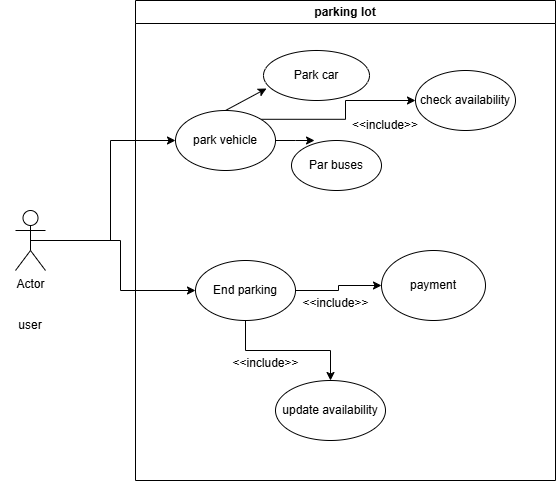
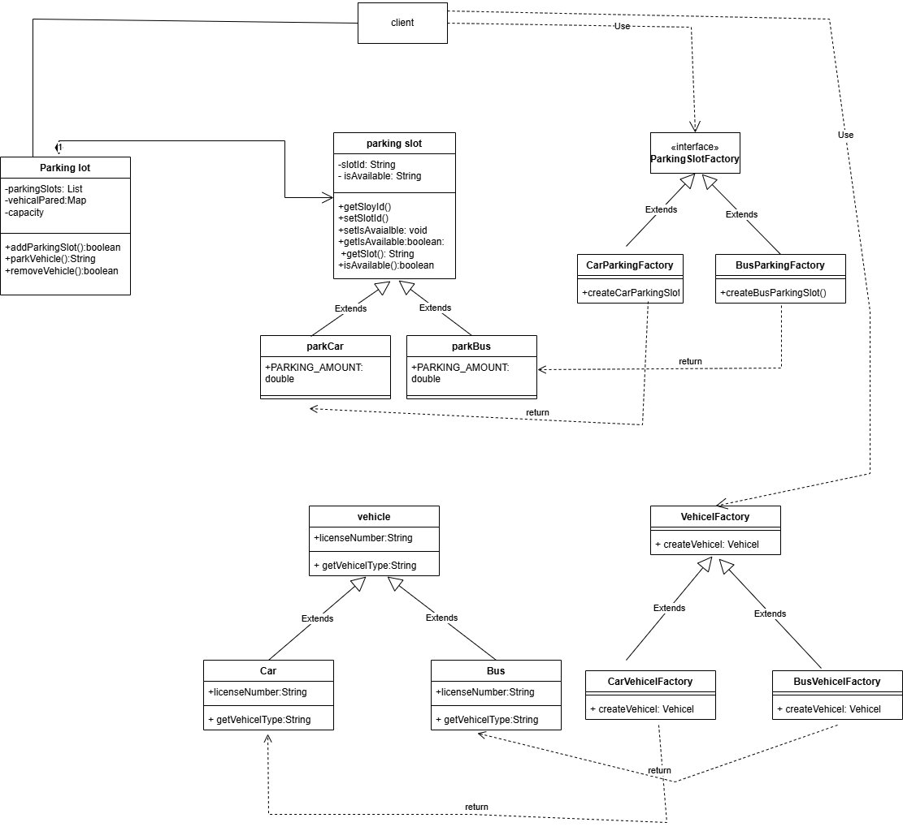

# Parking Lot System

## Overview

This project implements a simplified **Parking Lot Management System** using Object-Oriented Design principles in Java. The system supports basic functionality such as parking vehicles, tracking available parking slots, and managing different vehicle types.

The code follows a modular design pattern and uses inheritance and abstraction to manage various slot types and vehicles.

## Features

- Supports different vehicle types (e.g., Car, Bus)
- Different parking slot types corresponding to vehicle types
- Assigns parking slots dynamically based on vehicle type
- Basic management of parking lot slots and their availability
- Extensible design for adding more vehicle or slot types

## Use Case

### Actors

- **Driver**: Drives a vehicle and parks it.
- **Parking Lot System**: Manages parking slots and vehicles.

### Use Case: Park a Vehicle

1. Driver arrives with a vehicle.
2. The system checks for an available parking slot matching the vehicle type.
3. If a slot is available, the system assigns the slot to the vehicle.
4. If no slot is available, the driver is informed that the parking lot is full.
5. When the driver leaves, the slot is freed for other vehicles.

### Use Case Diagram

## Class Diagram

The system consists of these main classes:

- **Vehicle (abstract)**  
  Base class for all vehicles. Has subclasses like `Car`, `Bus` 

- **ParkingSlot (abstract)**  
  Base class for all parking slots with a unique slot ID and availability status.  
  Subclasses include `CarParkingSlot`, `BusParkingSlot`, etc.

- **ParkingLot**  
  Manages a collection of parking slots. Responsible for assigning and releasing slots.

- **VehicleType (enum)**  
  Enumerates supported vehicle types.

### Relationships

- `ParkingLot` contains many `ParkingSlot` objects.
- `ParkingSlot` can be assigned to a `Vehicle`.
- `Vehicle` and `ParkingSlot` types correspond based on vehicle type.

### Class Diagram

## How to Run

1. Clone the repository
git clone https://github.com/soumyasvaidya/parking-lot.git

2. Open the project in your favorite Java IDE (e.g., VSCode, IntelliJ)

3. Build and run the main classes or add your own test cases to simulate parking and releasing vehicles.

## Future Enhancements

- Support more vehicle and slot types (e.g., Truck, Handicapped)
- Add payment management
- Implement real-time slot availability notifications
- Add support for multiple floors and zones

